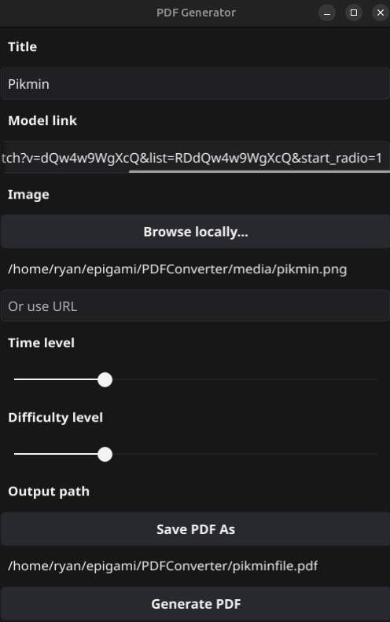

## Epigami_PDFConverter


Epigami_PDFConverter program convert any website link into QR Code and take : .png, .jpg, .jpeg, .gif and .bmp image format to illustrate the final .pdf

## Installation

```
sudo apt install golang
```

## Usage and information

```
go run *.go
```




## Contributors

[Neelthrys (Calixte)](https://codeberg.org/Neelthrys)